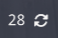
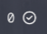

# waybar-apt-updates




A simple Waybar update checking script for distros using the APT package manager. It is a general script and could work with other bars or just be run in the terminal.

Credit goes to [this post](https://askubuntu.com/a/1210345) for the update command.

## How to use

Download the `checkupdates` script, put it in your [PATH](https://unix.stackexchange.com/a/26059) and make it executable (`chmod +x checkupdates`).

To configure, add the following to your Waybar config (`~/.config/waybar/config`).


```json
"custom/updates": {
    "exec": "$HOME/bin/checkupdates", // <--- path to script
    "on-click": "$HOME/bin/checkupdates", // refresh on click
    "interval": 900, // refresh every 15 minutes
    "return-type": "json",
    "format": "{} {icon}",
    "format-icons": {
        "has-updates": "", // icon when updates needed
        "updated": "" // icon when all packages updated
    }
},
```

To style use the `#custom-updates` ID in your Waybar styles file (`~/.config/waybar/styles.css`).

For more information see the [Waybar wiki](https://github.com/Alexays/Waybar/wiki).


